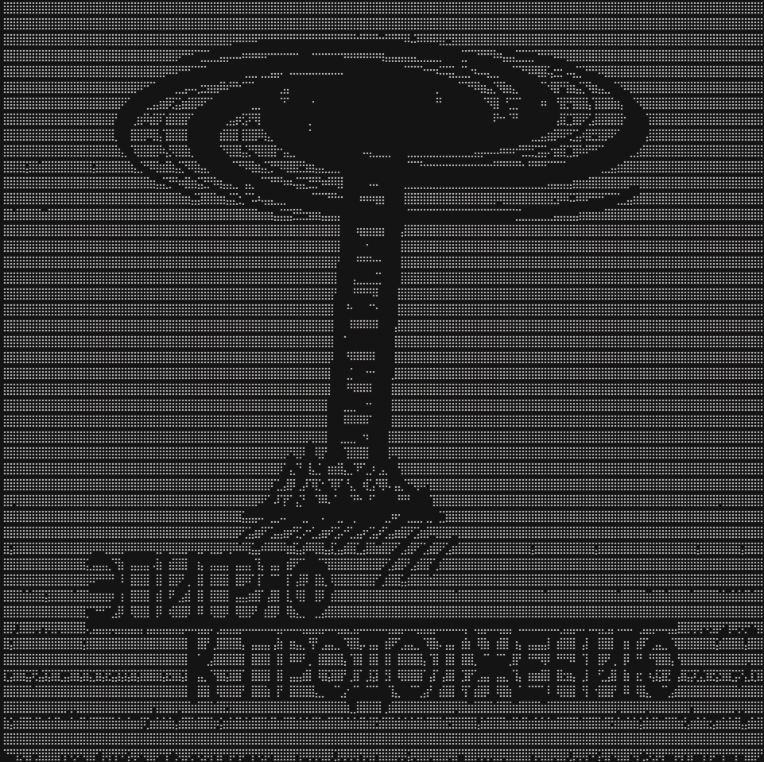

# Photo to Braille ASCII Art


Converts any image into Braille Unicode ASCII art. Each Braille character represents a 2×4 pixel block, creating detailed terminal-friendly art.

## Scripts

| Script | Description |
|---|---|
| `photo_to_braille.py` | Original version — adaptive threshold (25th percentile), fixed width 60 |
| `photo_to_ascii.py` | Improved version — sensitivity control, mean-based threshold, replaces empty Braille with space (removes noise bands), higher default width 120 |

## Example




## Usage

### photo_to_braille.py (original)

```bash
pip install Pillow
python photo_to_braille.py path/to/image.jpg
```

Output is printed to console and saved to `braille_art.txt`.

| Argument | Description |
|---|---|
| `path` | Path to image (optional — prompts if omitted) |
| `width` | Braille character width (default: 60) — edit in `image_to_braille()` |

### photo_to_ascii.py (improved)

```bash
python photo_to_ascii.py
# Then enter the path when prompted
```

Features:
- Higher default resolution (width=120)
- `sensitivity` parameter (0.5–1.5) to control line thickness
- Replaces empty Braille blocks with spaces — removes vertical banding
- Mean-based adaptive threshold

## How it works

1. Image is converted to grayscale and resized to `width × 2` pixels wide
2. Height is adjusted to maintain aspect ratio (rounded to multiple of 4)
3. Each 2×4 pixel block is mapped to a Braille Unicode character (U+2800–U+28FF)
4. Adaptive thresholding determines black/white cutoff

No external dependencies beyond Pillow.
